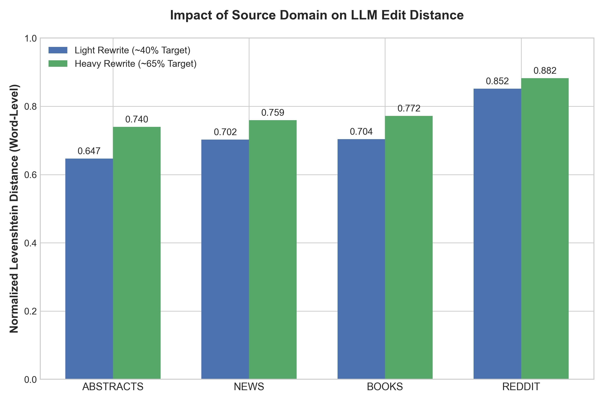
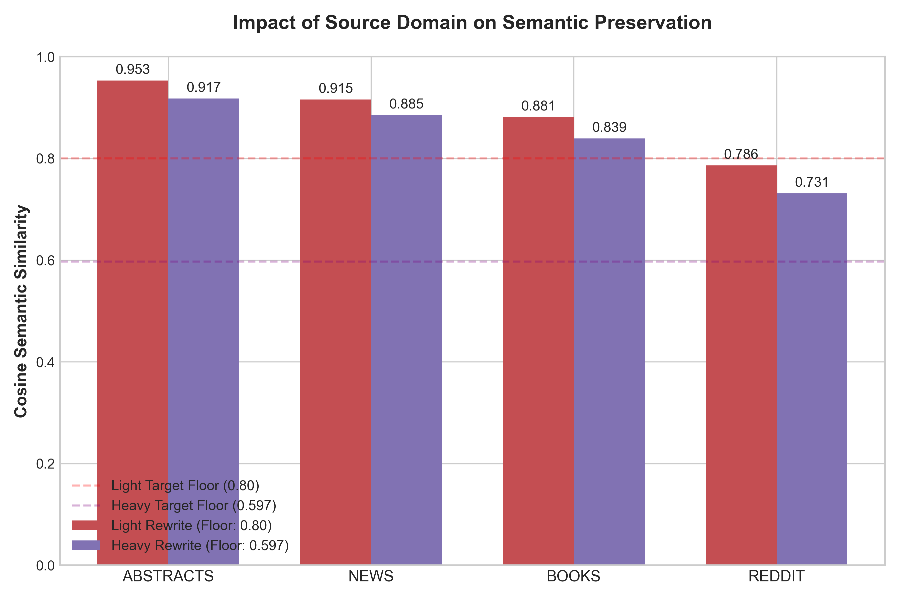
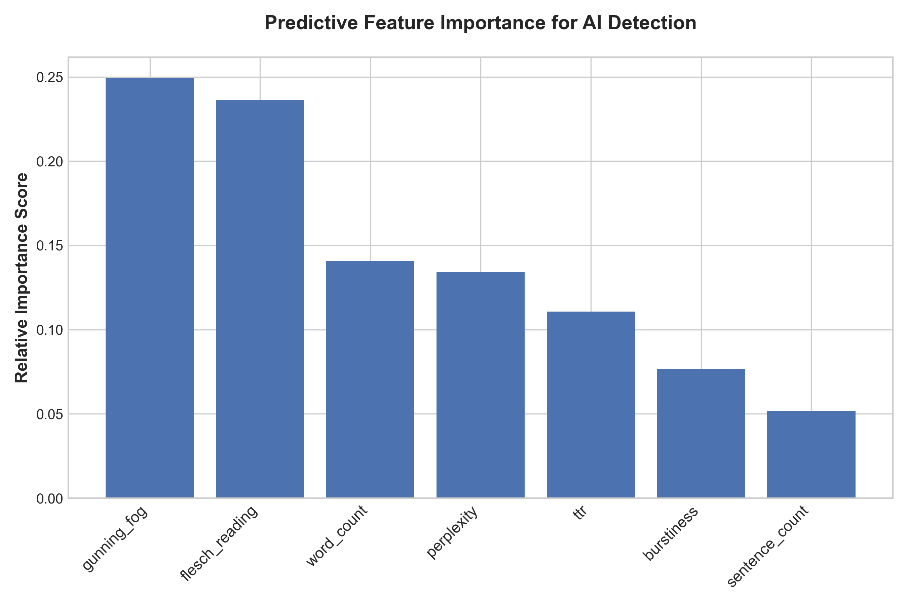
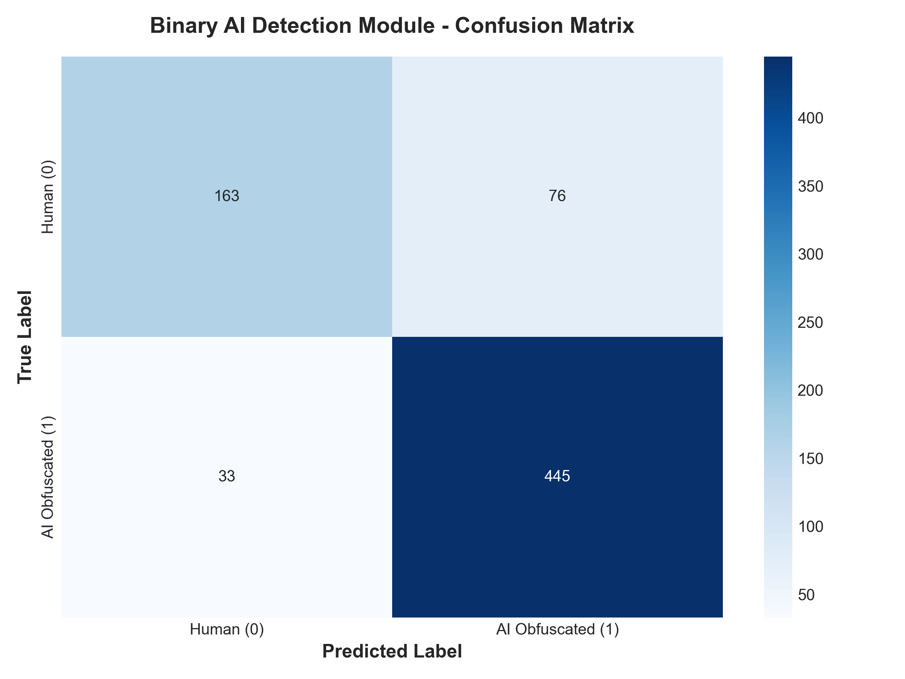

<div align="center">

# 🛡️ AI Text Obfuscation & Detection Module
### Empirical Analysis of LLM-Based Text Rewriting and Stylometric Evasion Detection

[](https://www.python.org/)
[](https://scikit-learn.org/)
[](https://pytorch.org/)
[](https://opensource.org/licenses/MIT)

*An advanced machine learning pipeline investigating how Large Language Models alter the syntactic and semantic structures of human writing—and how low-level feature extraction can defeat text obfuscation attacks with **84.80% accuracy**.*

</div>

---

## 📊 Visual Summary of Findings

<div align="center">

| **1. The Domain-Shift Effect** | **2. Semantic Trade-Off** |
| :---: | :---: |
|  |  |
| *Informal text (Reddit) requires up to 88% structural alteration to mimic academic tone.* | *High modification intensity forces semantic degradation below target floors.* |

| **3. Predictive Feature Importance** | **4. Real-World Binary Detection** |
| :---: | :---: |
|  |  |
| *Readability metrics (Gunning Fog, Flesch) outperform neural perplexity as primary AI markers.* | *Binary classification achieves an 84.80% accuracy rate and 93% AI recall.* |

</div>

---

## 🔍 Research Overview

As academic institutions grapple with AI-assisted text obfuscation, malicious actors and students increasingly rely on LLMs to rewrite natural text and evade detection tools. This research explores a fundamental question: **Can an AI-based detection module accurately identify machine-generated text even when the LLM is explicitly prompted to hide its tracks?**

This repository contains the complete end-to-end framework, encompassing data collection across four distinct genres, automated rewriting pipelines utilizing **Meta Llama 3.3 70B**, neural feature extraction via **GPT-2**, and a production-ready **Random Forest classifier**.

---

## 📈 Key Empirical Discoveries

* **The Domain-Shift Effect:** Source genre dictates LLM behavior. Highly formal texts (Scientific Abstracts) require minimal adjustment (~64% edit distance), whereas colloquial language (Reddit) undergoes near-total structural replacement (~85% edit distance) under identical academic prompting.
* **The Semantic Penalty:** Forcing an AI to elevate casual text to an academic standard causes a measurable degradation in semantic preservation, driving Cosine similarity below acceptable floors.
* **Model Signature Persistence:** In multi-tier evaluations (3-Class Model), the detector experienced high inter-class confusion between Light and Heavy rewrites (58.16% accuracy). This proves that **Llama 3.3 applies a rigid, underlying mathematical footprint** that overrides prompt-level rewriting intensity.
* **Operational Binary Efficacy:** Collapsing the classification problem into a binary framework (Human vs. AI Obfuscated) resolves class overlap, boosting detection accuracy to **84.80%** and successfully catching **93.09% of all obfuscated samples**.

---

## 🗂️ Repository Architecture

```text
ai-text-obfuscation-detection/
├── data/
│   ├── master_evaluated_dataset.csv   # 1,196-sample multi-domain dataset
│   └── ml_feature_dataset.csv         # Flattened ML feature matrix (3,582 rows)
├── models/
│   └── ai_detector_rf.joblib          # Serialized production Random Forest model
├── scripts/
│   ├── 02_clean_originals.py          # Data ingestion and normalization
│   ├── 03_llm_rewriting.py            # Meta Llama 3.3 70B generation pipeline
│   ├── 05_feature_extraction.py       # GPT-2 Perplexity, Burstiness & Stylometrics
│   ├── 06_train_classifier.py         # 3-Class Random Forest Model
│   └── 07_binary_classifier.py        # Binary Real-World Detection Model
├── figures/                           # High-res academic output charts (Figs 1–5)
├── requirements.txt                   # Environment dependencies
└── README.md
